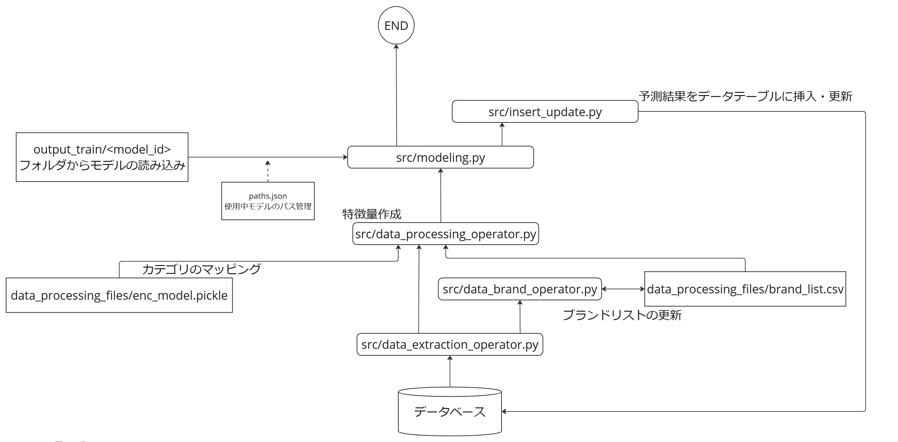
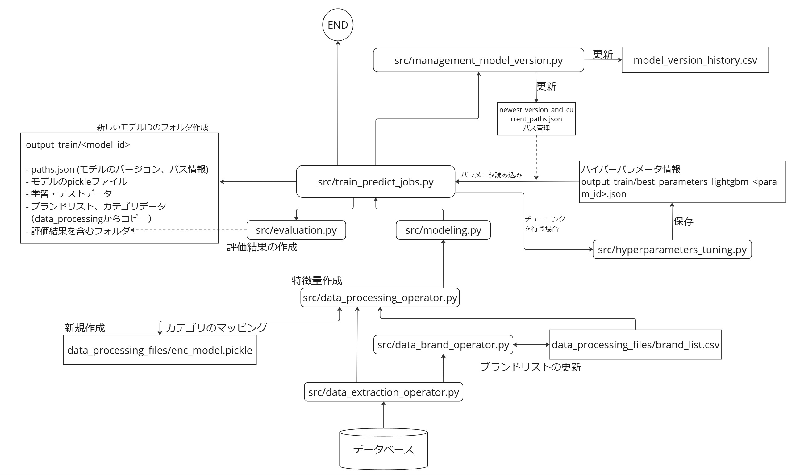

- [新台スコア予測モデル構築プロジェクト](#新台スコア予測モデル構築プロジェクト)
- [動作確認と再起動](#動作確認と再起動)
  - [推論の動作確認](#推論の動作確認)
  - [バージョンの作成履歴](#バージョンの作成履歴)
  - [モデルの使用履歴](#モデルの使用履歴)
  - [リモートサーバーへのアクセス方法](#リモートサーバーへのアクセス方法)
  - [リモートサーバーで仮想環境の起動](#リモートサーバーで仮想環境の起動)
  - [バックエンド再起動の方法](#バックエンド再起動の方法)
  - [学習バッチ処理の設定](#学習バッチ処理の設定)
- [ローカル環境の設定](#ローカル環境の設定)
- [モデルのバージョン管理](#モデルのバージョン管理)
  - [リモートとローカルのファイル移動方法](#リモートとローカルのファイル移動方法)
  - [学習](#学習)
  - [バージョンの切り替え](#バージョンの切り替え)
  - [ハイパーパラメータのチューニング](#ハイパーパラメータのチューニング)
- [システム全体像](#システム全体像)
  - [推論時のデータの流れ](#推論時のデータの流れ)
  - [学習時のデータの流れ](#学習時のデータの流れ)

# 新台スコア予測モデル構築プロジェクト
with 株式会社PREVA for Redesign


# 動作確認と再起動

## 推論の動作確認
- エンドポイント

```
http://162.43.27.232/get-data-ai
```

Pythonから確認する場合：

```python
import requests

url = 'http://162.43.27.232/get-data-ai'  

# リストで型式IDを入力
data = {
    "KatashikiIds": ['S2024090220360501']
}

headers = {
    'X-API-Key': '4JC223VNV5vAhGAf1488G97EMg7pyVY8oqWwFRQdDNvQ52dCJOfeHqRihFPXbOOW'
}

response = requests.post(url, json=data, headers=headers)

output = response.json()
print(output)
```

## バージョンの作成履歴

- model_loc.csv
  - created_at : モデルの作成日
  - model_version : モデルのバージョンID
    - ```{ハイパーパラメータの更新数}_{学習更新数}_{yyyymmddhhmmss}```
  - git\_commit_hashID : 学習直後のGitコミットのハッシュID
  - train\_start\_date,train\_end\_date : 学習開始日、学習終了日
  - test\_start\_date,test\_end\_date : テスト開始日、テスト終了日
  - train\_records,test\_records : 学習とテストのレコード数
    - 評価後は全期間のデータでモデルを学習して保存を行う
  - {目的変数}_rmse : 各予測の評価値

## モデルの使用履歴

- model\_version_history.csv
  - registered_at : モデルの使用開始時
  - model_version : モデルのバージョンID

## リモートサーバーへのアクセス方法
sshキーのファイル（ps-scope-ai.pem）を使用して、リモートサーバーにアクセス。以下をコマンドラインに打ち込む：

```
ssh -i ps-scope-ai.pem root@162.43.27.232
```
## リモートサーバーで仮想環境の起動
```
pyenv activate ai-py-venv
```

## バックエンド再起動の方法
リモートサーバーにアクセスを行った上

- 作動中のアプリケーションを確認

  ```
  ps aux | grep uvicorn
  ```
- アプリケーションの終了

  ```
  kill <id>
  ```
- FastAPIの起動

  ```
  pyenv activate ai-py-venv
  ```

  ```
  cd consulting_perva-redesign/
  ```

  バックグラウンドで起動

  ```
  nohup uvicorn app.main:app --host 0.0.0.0 --port 8000 --reload &
  ```

- もしデバック等の目的で出力を確認したい場合

    ```
    uvicorn app.main:app --reload --host 0.0.0.0 --port 8000
    ```
    推論のエンドポイントに入力を行い、動作の確認

## 学習バッチ処理の設定

- 現在設定の変更・確認  
以下のコマンドで設定内容を確認

```
crontab -e
```

以下が表示される

```
00 23 * * * cd /root/consulting_perva-redesign && ./executable_files/train_and_update.sh >> /tmp/cron_debug.log 2>&1
```

停止したい場合は、上記をコメント化する。

# ローカル環境の設定
pythonインストール済みのこと想定：

- gitレポジトリのクローン
- python仮想環境の作成
- ```pip install -r requirements.txt```


# モデルのバージョン管理

## リモートとローカルのファイル移動方法
- ローカルからリモートサーバーに移動  
   ターミナル上でconsulting_perva-redesignのフォルダに移動
   
   モデルフォルダの移動
   
   ```
  scp -i <ps-scope-ai.pemのパス> -r output_train/<model_id> root@162.43.27.232:/root/consulting_perva-redesign/output_train
   ```
   ※<model_id> = モデルのバージョンID   
   
  ハイパーパラメータの移動   
  
  ```
  scp -i <ps-scope-ai.pemのパス> output_train/best_parameters_lightgbm_<model_id>.json output_train/best_parameters_profit_lightgbm_<model_id>.json  root@162.43.27.232:/root/consulting_perva-redesign/output_train
   ```
- リモートサーバーからローカルに移動
  モデルフォルダの移動
  
  ```
  scp -i <ps-scope-ai.pemのパス> -r root@162.43.27.232:/root/consulting_perva-redesign/output_train/<model_id> output_train
   ```
   
  ハイパーパラメータの移動
  
  ```
  scp -i <ps-scope-ai.pemのパス> root@162.43.27.232:/root/consulting_perva-redesign/output_train/best_parameters_lightgbm_<model_id>.json root@162.43.27.232:/root/consulting_perva-redesign/output_train/best_parameters_profit_lightgbm_<model_id>.json output_train
   ```

## 学習
学習はバッチ処理で毎日行われている（[学習バッチ処理の設定](#学習バッチ処理の設定)）

以下は手動で行う時のシナリオ

リモートサーバーで行う場合：  
1 → 4

ローカルで行う場合：  
1 → 2 → 3 → 4

1. 学習の実行

```
executable_files/train_and_update.sh
```
※ windowsで行う場合は```train_and_update.bat``` を使用

2. モデルファイルをリモートサーバーに移動([リモートとローカルのファイル移動方法](#リモートとローカルのファイル移動方法))

3. リモートサーバーにアクセスをし、consulting_perva-redesignフォルダに移動して、git pull

4. [推論の動作確認](#推論の動作確認)

## バージョンの切り替え
  
  リモートサーバーで切り替える場合：  
  1 → 2 → 5

  ローカルで切り替える場合：  
  1 → 2 → 3 → 4 → 5

  1. 切り替えるモデルファイルが存在すること。([リモートとローカルのファイル移動方法](#リモートとローカルのファイル移動方法))

  2. 切り替えスクリプトの起動   
   consulting_perva-redesignフォルダに移動
  
  ```
  executable_files/change_version.sh
  ```    
  ※ローカルでwindowsの場合はchange_version.batを使う
  
  以下のメッセージが表示
  ```
  バージョンIDの入力:
  ```

  👆バージョンIDの入力を行う  
  
  3. 切り替えたモデルのファイルがリモートサーバーに存在すること([リモートとローカルのファイル移動方法](#リモートとローカルのファイル移動方法))
  4. リモートサーバーにアクセスをし、consulting_perva-redesignフォルダに移動して、git pull
  5. [推論の動作確認](#推論の動作確認)

## ハイパーパラメータのチューニング
 ローカルで行い、リモートサーバーを更新する

チューニング後に問題がない場合:  
1 → 2 → 4 → 5

チューニング後にバージョンを戻す必要がある場合:  
1 → 2 → 3

  1. チューニングと学習を実行

   ```
   executable_files/tuning.sh
   ```   

  ※windowsの場合は```tuning.bat``` を使用する

  2. 結果を確認（RMSE、ヒートマップの様子）
  3. もしモデルの切り替えが必要な場合、バージョンを戻す（[バージョンの切り替え](#バージョンの切り替え)）
  4. リモートサーバーにモデルのファイルを移動([リモートとローカルのファイル移動方法](#リモートとローカルのファイル移動方法))、そしてgit pull 
  5. 動作の確認（[推論の動作確認](#推論の動作確認)）

# システム全体像

## 推論時のデータの流れ
以下のダイアグラムは```app/main.py```にある、```predict```からの出力データの作成の流れ



## 学習時のデータの流れ
